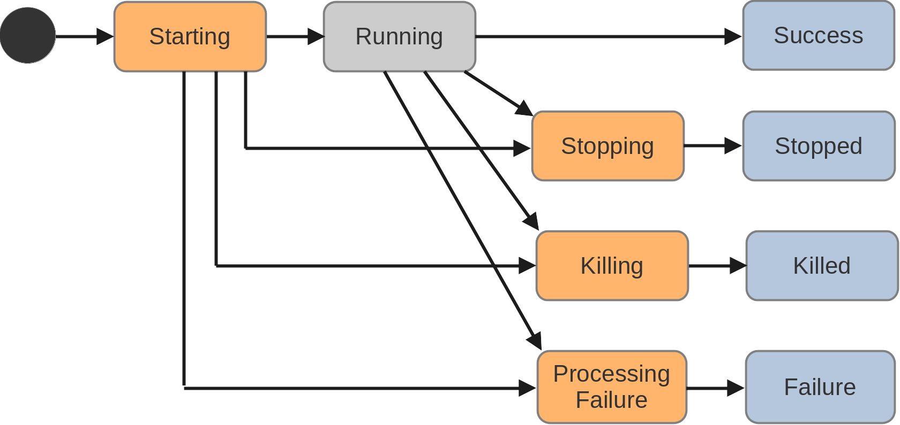
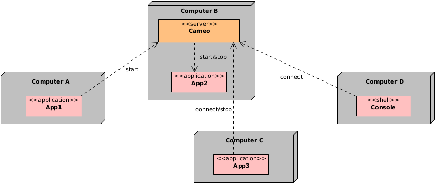

# Control the apps
The first goal of CAMEO is to provide services for starting, stopping, synchronizing remote applications. The control of the lifecycle of the applications is made either by the console i.e. *cmo* either programmatically using the API. Here are the controls:

* **Start**: Starts a remote application that will run on the contacted CAMEO server. The application must be registered.
* **Stop**: Stops a running remote application. The application is notified and can properly stop.
* **Kill**: Kills a running remote application. The application is immediately terminated.
* **Connect**: Connects a running application.
The combination of these controls gives lots of flexibility e.g. applications can be started in cascade.

## State diagram of an app

Every control is made by contacting the CAMEO server which is responsible to control the applications. Every CAMEO application has a sequence of states. The following diagram shows the complete possibilities:



The arrows show which transitions are possible.  

The different states are described:

* **Starting**: Once the CAMEO server received a *start* request for a valid application.
* **Running**: The application becomes *Running* after a defined amount of time or the application defined itself as running.
* **Success**: The application successfully terminated without any *stop* or *kill* request.
* **Stopping**: Once the CAMEO server received a *stop* request for a running application.
* **Stopped**: The application successfully terminated after a *stop* request.
* **Killing**: Once the CAMEO server received a *kill* request for a running application.
* **Killed**: The application successfully terminated after a *kill* request.
* **Processing Failure**: Once the application encountered an internal error and terminated. An error process specific to the application is called.
* **Failure**: The error process has terminated.

Once the CAMEO server is changing the state of an application, it also publishes the new state as an event. All the connected clients receive the new state and can react to it.

## Events in the API and the console

Let's take a concrete example and show how to do it with the API and the console. Here is the diagram showing the interactions: 



Sequence of actions:

* The application *App1* on *A* is contacting the CAMEO server on *B* to start *App2*.
* The application *App2* is running on *B*.
* The application *App3* on *C* is contacting the CAMEO server on *B* to connect *App2*.
* The console on *D* is contacting the CAMEO server on *B* to connect *App2*.
* The application *App3* on *C* stops *App2*.
* The application *App1* and console are notified that *App2* stopped.

Let's see the code for each application. The application *App2* written in Java can look like:

```java
import eu.ill.cameo.base.This;

public class JavaApp {

    public static void main(String[] args) {
		
        // Initialize the CAMEO application represented by This.	
        This.init(args);
		
        // Infinite printing loop.
        int i = 0;
        while (true) {
            System.out.println("Printing " + i);
            try {
                Thread.sleep(100);
            }
            catch (InterruptedException e) {
            }
            i++;
        }

        This.terminate();	
    }
}
```

It simply prints a new line every 100 ms infinitely. Notice that the name "App2" is the name of the application registered in the CAMEO server so that there is no link with the class name.
Moreover consider that the app is registered so that its standard output and error are streamed.

The application *App1* written in C++ has the following lines:

```cpp
#include <cameo/api/cameo.h>
#include <iostream>

int main(int argc, char *argv[]) {

    // Define the reference to the CAMEO server in B.	
    std::unique_ptr<cameo::Server> server = cameo::Server::create("tcp://B:7000");

    // Initialize the server.
    server->init();

    // Start the application "App2" and obtain a reference to the running app.
    std::unique_ptr<cameo::App> app2 = server.start("App2");

    // Wait for the end of the app and get the terminal state.
    cameo::State state = app2->waitFor();

    // Print the terminal state.
    std::cout << "The application " << *app2 
              << " terminated with state " << cameo::toString(state) << std::endl;

	return 0;
}
```

It simply contacts the CAMEO server in B and starts *App2* then waits for its termination.

The application *App3* written in Python has the following lines:

```python
import cameopy

# Define the reference to the CAMEO server in B.
server = cameopy.Server.create("tcp://B:7000")

# Initialize the server.
server.init()

# Connect the application "App2" that is supposed running.
app2 = server.connect("App2")

# Stop the app.
app2.stop()

# Wait for the end of the app and get the terminal state.
state = app.waitFor()

print("The application", app2.toString(), "terminated with state", cameopy.toString(state))
```

On computer *D*, the console connects to *App2* and receives some output before *App2* is stopped:

```
cmo -e tcp://B:7000 connect App2 
Connected App2.5
Printing 5
Printing 6
Printing 7
Printing 8
The application App2.5 terminated successfully.
```

The lines starting with *Connected* and *The application* are written by the console whereas the lines starting with *Printing* come from the app itself as it was configured to stream its error and output.

The calls to *waitFor()* were blocking and the termination of *App2* unblocked them as an event was sent from the CAMEO server to all the clients. The console received the error and output stream before stopping, the *connect* command being blocking.

## Using the console

The console *cmo* offers interesting features to start or monitor a CAMEO environment. To print the help:
```
cmo
```

To display the list of registered apps that can be started:
```
cmo list
```

By default, the CAMEO server is the local on the 7000 port but it can be configured.
If a CAMEO server is running on the port 8000:
```
cmo -p 8000 list
```

If a CAMEO server is running on *B*:
```
cmo -e tcp://B:7000 list
```

To start *App2* from localhost:
```
cmo start App2
```

The command immediately returns. Then it is possible to see if it is running:
```
cmo apps
Name ID        PID       Status              Args
-------------------------------------------------
App2 5         9087      RUNNING
```

The *ID* is the id of the CAMEO server which is unique different from the *PID* which is the common system process id.

We can connect to it now:
```
cmo connect App2
Printing 8
Printing 9
Printing 10
Q
```
The command is blocking and typing *ctl+c* or *shift+q* stops the command but not the app.

To stop *App2*:
```
cmo stop App2
```

As there is no stop handler defined for *App2*, the stop is equivalent to a kill, so we could have done:
```
cmo kill App2
```

To start *App2* with a blocking command, we can use:
```
cmo exec App2
Printing 1
Printing 2
Printing 3
Printing 4
^CKilled App2.6.
```
This time we typed *ctl+c* to kill the app. We could have used *shift+s* to cleanly stop the app or *shift+q* to exit the console without stopping the app which would still run in background.

Some additional commands and features can be interesting to know. 

We saw that by default *cmo* contacts the local CAMEO server on port 7000. You can change that by defining the *CAMEO_SERVER* environment variable e.g. with *tcp://localhost:8000* which can be useful if you configured the CAMEO server with that port.

You can display the CAMEO server endpoint:
```
cmo endpoint
```
You can display the version of the server:
```
cmo version
```

## Pass arguments

It is possible to pass arguments to a *start* request. With the console it is naturally done:
```
cmo start App2 -debug true -timeout 10
```
This example shows that the arguments *-debug true -timeout 10* will be passed to the executable. It can also be done with the APIs. In C++:
```cpp
server.start("App2", {"-debug", "true", "-timeout", "10"});
```
In Java:
```java
server.start("App2", new String[]{"-debug", "true", "-timeout", "10"});
```
In Python:
```python
server.start("App2", ["-debug", "true", "-timeout", "10"]);
```
These arguments are set after the arguments defined into the configuration file.

## Application state

There are different ways to get the state of an app. We already saw that *waitFor()* returns a state which is the last state of the app execution. You can also get the states directly:

For example in C++:
```cpp
// Get the last execution state.
cameo::State state = app->getLastState();

// Get the actual state that can be NIL if the app is not executing anymore.
cameo::State state = app->getActualState();

// Get the past execution states, e.g. from RUNNING to SUCCESS.
std::set<cameo::State> states = app->getPastStates();
```

The call to *getLastState()* does not invoke a call on the CAMEO server but only pulls all the states already received. If the app has terminated then it should be *SUCCESS*, *STOPPED*, *KILLED* or *FAILURE*.
However a call to *getActualState()* makes a request to the CAMEO server i.e. it can fail if the server is not accessible anymore.

## Exit code

Sometimes we need to get the exit code of an app. It is possible to do it with the API as well as with the console. The APIs provide the *getExitCode()* function or method of the *Instance* class. 
We suppose to have an *App4* application that returns after a certain amount of time.

For example in C++:
```cpp
// Connect the application "App4" and obtain a reference to the running app.
std::unique_ptr<cameo::App> app4 = server.connect("App4");

// Wait for the end of the app and get the terminal state.
cameo::State state = app4->waitFor();

// Get the exit code.
int exitCode = app4->getExitCode();
```

To get the value of the exit code of the app with the console depends on the *shell* you use.
With a bash shell:
```
cmo exec App4
The application App4.13 terminated successfully.
exitCode=$?
```

What you do with this code is on your own.

## Stop handler

We saw before that there was a difference between a *stop* and a *kill* request. The CAMEO server immediately stops the app for a *kill* request whereas in case of a *stop* request it sets the state *STOPPING* to the app. The app receives the *STOPPING* event and a stop handler is triggered if it has been registered allowing to properly terminate the app.

The C++, Java and Python APIs support the stop handler. An example in C++:
```cpp
#include <cameo/api/cameo.h>
#include <atomic>
#include <iostream>

int main(int argc, char *argv[]) {

    // Init the app.
    cameo::This::init(argc, argv);

    // Shared variable.
    std::atomic_bool stopping(false);

    // Define a stop handler.
    cameo::application::This::handleStop([&] {
        std::cout << "Stop handler executed" << std::endl;
        stopping.store(true);
    });

    // Loop until stop is triggered.
    while (!stopping.load()) {
	std::this_thread::sleep_for(std::chrono::milliseconds(100));
    }

    return 0;
}
```

This example uses an *std::atomic_bool* variable to stop the while loop.

An example in Java:
```java
import eu.ill.cameo.base.This;
import java.util.concurrent.atomic.AtomicBoolean;

public class JavaStop {

    // Shared variable.
    public static AtomicBoolean stopping = new AtomicBoolean(false);
	
    public static void main(String[] args) {

        // Init the app.
        This.init(args);
	
        // Define a stop handler.
        This.handleStop(() -> {
            System.out.println("Stop handler executed");
            stopping.set(true);
        });

        // Loop until stop is triggered.        
        while (!stopping.get()) {
            try {
                Thread.sleep(100);
            }
            catch (InterruptedException e) {
            }
        }

        This.terminate();			
    }
}
```

This example also uses an *AtomicBoolean* variable to stop the while loop.

An example in Python:
```python
import cameopy
import sys
import time
from threading import Event

# Init the app.
cameopy.This.init(sys.argv)

# Shared variable.
stopping = Event()

# Define the stop handler.
def stop():
    print("Stop handler executed")
    stopping.set()

# Register the handler.
cameopy.This.handleStop(stop)

# Loop until stop is triggered.
while not stopping.is_set():
    time.sleep(0.1)
```

The Python example follows the same principle as the C++ and Java examples but this time we use the *Event* object provided by the *threading* module to share the stopping state.

To finish, it is **highly recommended** to follow these guidelines to implement a stop handler:

* Do not implement cleaning code e.g. resource deallocation in stop handlers.
* Only write code that unblocks blocking calls: graphical loop, etc.
* Let the cleaning code at the very end of the main.

## Connect to the starter app

There are some use cases where it is interesting or even necessary to get a reference to the application that started *this* application.
Let's take the previous example where we defined the code of *App2*. We modify it to get an access to the *starter* app:
```java
import eu.ill.cameo.base.This;

public class JavaApp {

    public static void main(String[] args) {
		
        // Initialize the CAMEO application represented by This.	
        This.init(args);
	
        // Get the starter app.
        ServerAndApp starter = This.connectToStarter();

        // Infinite printing loop.
        int i = 0;
        while (true) {
            System.out.println("Printing " + i);
            try {
                Thread.sleep(100);
            }
            catch (InterruptedException e) {
            }
            i++;
        }
        starter.terminate();
        This.terminate();	
    }
}
```

In our example, the *starter* app should be the running application *App1*. But be careful, the application could have terminated since it sent the request to start *App2*. In C++ and Python, the function is also *connectToStarter()* member of the *This* object.

Once you have a reference to the *starter* you can decide to stop it or use it to connect a communication object.

## Standard error and output

The standard error and output can be printed by the console application or retrieved by the API. For that the attribute *stream* of the application tag must have been set to *yes* in the configuration of the application. See the page [Configure a server](configure-a-server.md).  
An example with the C++ API:
```cpp
// Start the app with the OUTPUTSTREAM option.
std::unique_ptr<cameo::App> app = server.start("App2", cameo::OUTPUTSTREAM);

// Get the outputstream socket.
std::shared_ptr<cameo::OutputStreamSocket> socket = app->getOutputStreamSocket();

// Define a thread to retrieve the output.
std::thread outputThread([&] {
    while (true) {
        std::optional<Output> output = socket->receive();
        if (output) {
            std::cout << output.value().getMessage() << std::endl;
        }
        else {
            // The socket has terminated normally or was canceled.
            return;
        }
    }
});

// Wait for 1s.
std::this_thread::sleep_for(std::chrono::seconds(1));

// Stop the output stream socket.
socket->cancel();

// Wait for the end of the thread.
outputThread.join();
```

Starting the application with the option *OUTPUTSTREAM* creates an output stream socket so that all the stream can be retrieved.

Same example in Java:
```java
// Start the app with the OUTPUTSTREAM option.
App app = server.start("App2", Option.OUTPUTSTREAM);

// Get the outputstream socket.
OutputStreamSocket socket = app.getOutputStreamSocket();
		
// Define a thread to retrieve the output.
Thread outputThread = new Thread(() -> {
    while (true) {
        Output output = socket.receive();
        if (output != null) {
            System.out.println(output.getMessage());
        }
        else {
            // The socket has terminated normally or was canceled.
            return;
        }
    }
});	
outputThread.start();
		
// Wait for 1s.
try {
    Thread.sleep(1000);

    // Stop the output stream socket.
    socket.cancel();

    // Wait for the end of the thread.
    outputThread.join();
			
}
catch (InterruptedException e) {
}
```

And the Python example:
```python
import threading

# Define the function retrieving the output.
def printOutput(socket):
    while True:
        output = socket.receive()
        if output:
            print(output.getMessage())
        else:
            # The socket has terminated normally or was canceled.
            return

# Start the app with the OUTPUTSTREAM option.
app = server.start("streampy", cameopy.OUTPUTSTREAM)

# Get the outputstream socket.
socket = app.getOutputStreamSocket()    

# Start the thread.
t = threading.Thread(target=printOutput, args=(socket,))
t.start()

# Wait for 1s.
time.sleep(1)

# Stop the output stream socket.
socket.cancel()

# Wait for the end of the thread.
t.join()
```

Retrieving the output may not be only restricted to debug. If you need to integrate an external program that only has output, control could be done by analyzing the output stream.

## Unlinked apps

By default, if *App1* starts *App2* and *App1* finished before *App2* then *App2* will be stopped i.e. a stop request will be sent to its CAMEO server. This default behaviour avoids to have orphaned apps that have in fact no reason to live especially if their starter app terminated unexpectedly.

However there are some cases where it is interesting to detach the lifecycle of an app from its starter. In that case, you simply have to specify it in the start command.

In C++:
```cpp
std::unique_ptr<cameo::App> app2 = server.start("App2", cameo::UNLINKED);
```

In Java:
```java
App instance = server.start("App2", Option.UNLINKED);
```
