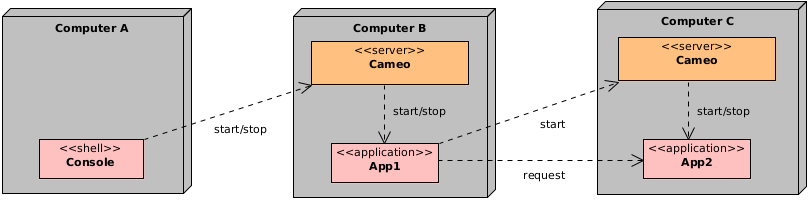

# Welcome to CAMEO
CAMEO is a lightweight middleware providing services to write **distributed** applications running on **any** platform and language. CAMEO focuses on the applications which are the main components of the CAMEO middleware.

CAMEO allows:

* Starting, stopping, synchronizing your apps wherever they run: CAMEO is a **remote application manager**.
* Making your apps communicate: **High-level communication patterns** are provided.
* **Single** entry point for running the entire network of apps.

The CAMEO middleware is made up of:

- A **server** application configurable and running on any host.
- A **console** application running on any host.
- Different **APIs** for C++, Java, Python languages.

CAMEO is very flexible and many different use cases are possible. 
There is **no constraint** on the applications that can be managed by CAMEO:
graphical or black box applications are supported. With CAMEO, it becomes very easy to **integrate** any external component including proprietary software.

## Typical use case

Following diagram shows a typical use case:

Three computers *A*, *B*, *C* are used. A CAMEO server is running on the computers *B* and *C*. The applications *App1* and *App2* are installed on *B* and *C* and registered into the respective CAMEO servers.  
Sequence of actions:

- Execute a console to start the execution of *App1* by contacting the CAMEO server on *B*.
	- The application *App1* is starting and starts the execution of *App2* by contacting the CAMEO server on *C*.
	- *App1* is waiting for the initialization of *App2* and once it is done, *App1* is sending requests to *App2* that is responding to *App1*.
- Use the console to stop the execution of *App1*.
	- *App1* is stopping and stops *App2*.

Notice that the interaction between *App1* and *App2* is made using the API.
This example shows that with a **single** entry point with the console, two apps are started, synchronized and communicate.

Contact legoc@ill.eu for any help.