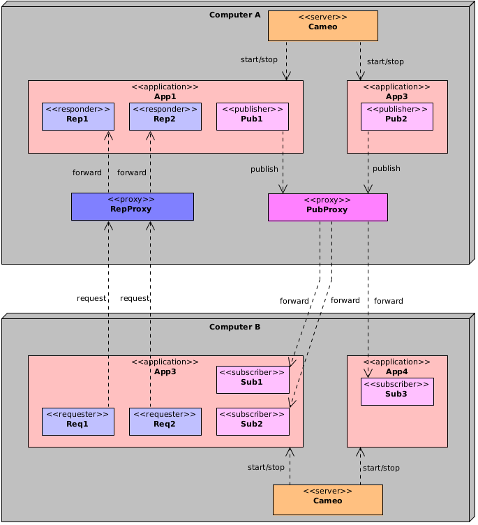

# Use the proxies with a firewall


In the context of a firewall, you may run the CAMEO server with proxies so that the number of exposed ports is fixed.

## Open ports

CAMEO communication is based on ZeroMQ for which main sockets own a port. For instance you open a *REP* or a *PUB* socket by opening a new port. CAMEO communication objects *Responder* and *Publisher* have between one and two ports opened dynamically. Moreover the CAMEO server itself opens some ports. As a consequence, the **number of ports** used by a CAMEO application can **increase** rapidly.  

The following diagram is showing two apps communicating with some *Requester*/*Responder* and *Publisher*/*Subscriber* objects:


There is at least five open ports that must be accessible from the computer *B*. Moreover as they are dynamically opened, they may not always have the same value.
In the context of a **firewall** which needs to minimize the number of ports accessible from outside, this is not suitable.

The solution is to use proxies.

## Use of proxies

Using proxies allows to forward messages. There is a responder proxy which is a relay between the *Requester* and the *Responder* objects. There is also a publisher proxy which is a relay between the *Subscriber* and the *Publisher* objects.

The proxies are launched by the CAMEO server. You simply have to specify which ports they will use. For instance you can specify in the configuration file:
```xml
proxy_ports="10000, 10001, 10002"
```
The first port 10000 is the port of the responder proxy. The second port 10001 is the port of the publisher proxy. The third port is for internal use.

The following diagram is now showing the same apps with the responder and publisher proxies configured on the computer *A*:



The applications on computer *B* access the responders and publishers through the proxies.
However passing through the proxies is not automatically done. It must be specified at the creation of the CAMEO server object referencing the server of the computer *A*.

If you were not using the proxies, the creation would have been in C++ for *App3*:
```cpp
auto server = cameo::Server::create("tcp://A:7000");
```
The port is the base port of the CAMEO server.

However the C++ creation of the CAMEO server with proxies:
```cpp
auto server = cameo::Server::create("tcp://A:10000", cameo::option::USE_PROXY);
```
In Java:
```java
Server server = Server.create("tcp://A:10000", Option.USE_PROXY);
```

The first argument of *Server::create()* is the responder proxy endpoint and the second argument is the integer telling that this is the proxy port.

Once the server is created, the definition of a *Requester* or *Subscriber* is exactly the same as before.

## Proxy path

Currently, the proxy programs are written in C++. When the CAMEO server starts, it tries to launch the proxy programs. However if they are not installed in a standard path, they may not be found. In that case, an argument is provided:

```
java -jar java/server/target/cameo-server-2.0.0-full.jar --proxy-path /my/path/to/proxies config.xml
```

## Override ports of the configuration

It is possible to override the ports of the configuration by defining them in the command line:

```
java -jar java/server/target/cameo-server-2.0.0-full.jar --proxy-ports "12000, 12001, 12002" config.xml
```


## Multiple servers

If multiple servers are running on the same computer, give different proxy ports to the servers so that they are not shared.

## List of functions or methods using the proxies

Here is the list of functions or methods that can be parameterized with a proxy:

**Class**        | **Function/Method**    
-----------------|------------------------
*Server*         | *create()*               
*This*           | *connectToStarter()*               
*basic::Request* | *connectToRequester()*               
*multi::Request* | *connectToRequester()*               

If the a server has been created with a proxy then the *App* objects that it returns will also use the proxy.

Notice that it is possible that each computer has a CAMEO proxy and two remote apps use them to communicate. Look at the following example:


*App2* on the computer *B* is connecting to *App1* on computer A. For that the CAMEO server representing *A* on *B* is created with a proxy. A message is sent to the proxy of *A* that forwards it to the CAMEO server.

Then *App2* requests *App1* using the proxy automatically. This time when *App1* receives a request it connects to the requester. For that it is using the proxy meaning that it sends a message to the proxy of *B* that is forwarded to *App2*.
